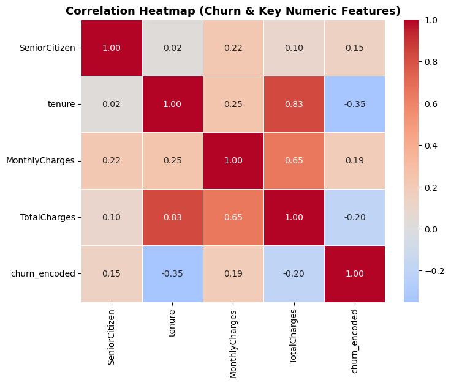
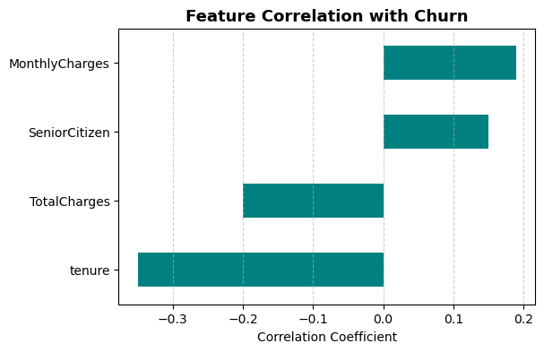
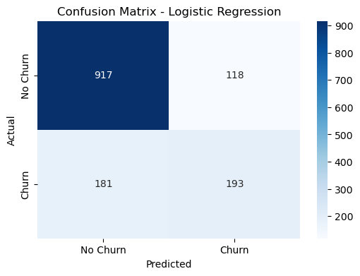

 #### Overview
 This project analyses customer churn for a telecom company and builds a classifier to predict which customers are likely to leave. The goal is two-fold: first, understand patterns that drive customers to churn using exploratory data analysis (EDA); second, produce a baseline machine learning classifier that flags at-risk customers so the business can act (targeted retention, offers, product fixes).
The dataset is the IBM Telco Customer Churn sample [WA_Fn-UseC_-Telco-Customer-Churn.csv](https://www.kaggle.com/datasets/blastchar/telco-customer-churn). It contains customer demographics, subscription details (services), account information (tenure, monthly charges, total charges), and the churn label.

#### Questions
This project answers the following:
1.	What patterns and customer segments are associated with churn?
2.	How do tenure, monthly charges and total charges relate to churn?
3.	Which categorical features (contract type, payment method, internet service, etc.) show the largest churn differences?
4.	Can a classifier reliably predict churn using the available features? Which features contribute most to predictions?

#### Tools Used
- Python (primary language)
    - pandas for data manipulation
    - numpy for numeric ops
    - matplotlib / seaborn for plots
    - scikit-learn for encoding, scaling, model training and evaluation

- Jupyter / VSCode for notebooks and development
- Git & GitHub for version control and publishing

#### Data Preparation and Cleanup
##### Import and Initial Clean
``` python
import pandas as pd
import matplotlib.pyplot as plt
import seaborn as sns
df = pd.read_csv(r"C:\Users\User\Documents\WA_Fn-UseC_-Telco-Customer-Churn.csv")
df['TotalCharges'] = pd.to_numeric(df['TotalCharges'], errors='coerce').fillna(0).astype(float)
```
- Note: TotalCharges had blanks; converting with pd.to_numeric(..., errors='coerce') turns bad strings to NaN. I filled those with 0 because tenure was 0 for those rows (new customers).

#### Exploratory Data Analysis (EDA)
I ran aggregated counts and churn breakdowns (total, churned, not-churned) for key categorical features and explored numeric relationships with churn.
View the detailed steps here: [customer_churn_eda](customer_churn_eda.ipynb)

##### Example Aggregates (InternetService)
``` python
df_t2 = df.groupby('InternetService').size().sort_values(ascending= False).reset_index(name= 'internetcount')
df_tnc = df_t1.groupby('InternetService').size().sort_values(ascending= False).reset_index(name= 'internetcount_nochurn')
df_tc = df_churnn.groupby('InternetService').size().sort_values(ascending= False).reset_index(name= 'internetcount_churn')
df_t3 = df_t2.merge(df_tnc, on= 'InternetService', how= 'left').merge(df_tc, on= 'InternetService', how= 'left')
df_t3['%churn_typewise'] = (df_t3['internetcount_churn']/df_t3['internetcount'])*100
df_total_churn = len(df_churnn)
df_t3['%churn_wrt_Gc'] = (df_t3['internetcount_churn']/df_total_churn)*100
df_t3
```
#### Key EDA Findings
- Overall churn rate: ~26.5% (1,869 of 7,043 customers).
- Internet service: Fiber optic shows the highest churn count and the highest contribution to global churn (%churn_wrt_Gc), with a high within-type churn rate (~42% of fiber customers churned).
- Gender: Both female and male genders are approximately equally distributed accross the dataset. They have approximately the same churn rate.
- Contract: Month-to-month customers both dominate the dataset and contribute heavily to churn (month-to-month churn rate ~43%). Two-year contracts have very low churn rates.
- Payment method: Electronic check has the highest churn rate and contributes most to global churn.
- Correlations (numeric):
   - tenure and churn show negative correlation (~-0.35).
   - monthly charges correlate positively with churn (~0.19).
   - total charges correlate moderately with tenure and negatively with churn (~-0.20).
   - This suggests shorter-tenure customers (new customers) are more likely to churn and higher monthly charges slightly increase churn probability.

#### Visualzation
##### Code snippet (heatmap and correlation bar)
```python
# Correlation Heatmap
plt.figure(figsize=(8,6))
sns.heatmap(correlation, annot=True, cmap='coolwarm', center=0, linewidths=0.5, fmt='.2f')
plt.title('Correlation Heatmap (Churn & Key Numeric Features)', fontsize=13, fontweight='bold')
plt.show()

# Correlation with Churn (Bar Chart)
plt.figure(figsize=(6,4))
correlation['churn_encoded'].drop('churn_encoded').sort_values(ascending=False).plot(
    kind='barh', color='teal')
plt.title('Feature Correlation with Churn', fontsize=13, fontweight='bold')
plt.xlabel('Correlation Coefficient')
plt.ylabel('')
plt.gca().invert_yaxis()
plt.grid(axis='x', linestyle='--', alpha=0.6)
plt.show()
```




#### Classifier
I trained a logistic regression baseline with standardized features. View the full steps right from the encoding stage here: [churn_classifier](churn_classifier.ipynb)

#### Train / test split, scaling and model
```python
from sklearn.model_selection import train_test_split
from sklearn.preprocessing import StandardScaler
from sklearn.linear_model import LogisticRegression

X_train, X_test, y_train, y_test = train_test_split(X,y,test_size= 0.2, random_state= 21)

scaler = StandardScaler()
X_train_scaled= scaler.fit_transform(X_train)
X_test_scaled= scaler.transform(X_test)

log_reg = LogisticRegression(random_state= 0).fit(X_train_scaled, y_train)

y_pred = log_reg.predict(X_test_scaled)
```

#### Performance
- Train accuracy: ~0.81
- Test accuracy: ~0.79
- Confusion Matrix 

- Classifcation Report (view the full report [here](churn_classifier.ipynb))
    - Interpretation: Model does okay at identifying non-churners but struggles more to recall churners (lower recall on class 1). This is typical when classes are imbalanced and when available features only partly explain churn.
#### Feature Importance
I extracted coefficients from the logistic model (sorted descending):
- Top positive coefficients (increase churn probability):
    - InternetService_Fiber optic,StreamingTV_Yes, MultipleLines_Yes, PaperlessBilling, PaymentMethod_Electronic check
- Top negative coefficients (reduce churn probability):
    - Tenure, Contract_Two year, Contract_One year, OnlineSecurity_Yes, MonthlyCharges
    
These indicate that PaperlessBilling, StreamingTV, MultipleLines, electronic check payment, and fiber internet are associated with higher churn probability in this dataset. Longer contracts, more tenure, online security, and MonthlyCharges are associated with lower churn likelihood.

#### Key Takeaways (What I learnt)
- Feature signals exist but are partial. Contract type and tenure are strong signals. Some external drivers (pricing changes, market events, competitor promotions) are not captured by the dataset and could explain residual churn.
- Modeling trade-offs. Baseline logistic regression gives interpretable coefficients and a reasonable snapshot. However, recall on churners needs improvement for production use.
- Data preparation matters. Handling TotalCharges blanks and carefully encoding categorical features materially affects results.

#### Challenges faced:
- Missing / messy values in TotalCharges required careful handling and domain thinking.
- Imbalanced classes: churn is ~26% which is manageable but still affects recall for the positive class.
- Feature redundancy: TotalCharges is a function of MonthlyCharges × tenure. I tested both inclusion and exclusion to check multicollinearity effects.

#### Conclusion
This project demonstrates a practical EDA and baseline classifier for telco churn. Key actionable findings: fiber subscribers, and those paying by electronic check are higher-risk groups; tenure and longer contracts strongly mitigate churn. The logistic baseline gives interpretable feature effects and reasonable accuracy, but improving recall for churners should be the immediate next modeling priority. With better feature engineering, class-handling strategies, and advanced models, this pipeline can be made production-ready for targeted retention efforts.

